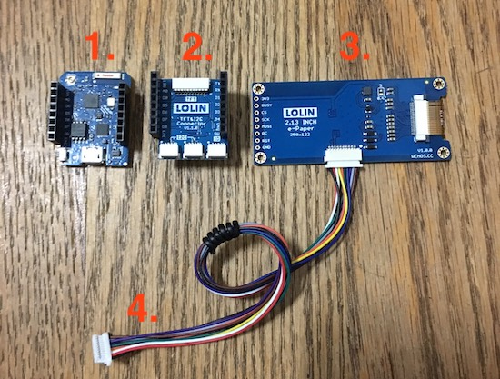

# QRCode ePaper for D1 mini

 

## § 材料準備

1. [LOLIN D1 mini](https://wiki.wemos.cc/products:d32:d32_pro)
2. [ePaper 2.13 Shield](https://wiki.wemos.cc/products:d1_mini_shields:epd_2.13_shield)
3. TFT e-Paper Cable

可以在 [WEMOS.CC](https://www.wemos.cc/) 找到這些零件的購買網址與詳細資訊。

> 購買網址：[LOLIN Official Store](https://lolin.aliexpress.com/store/1331105)

 

## § 組裝

將 ePaper Shield 連接到 LOLIN D1 mini：

 